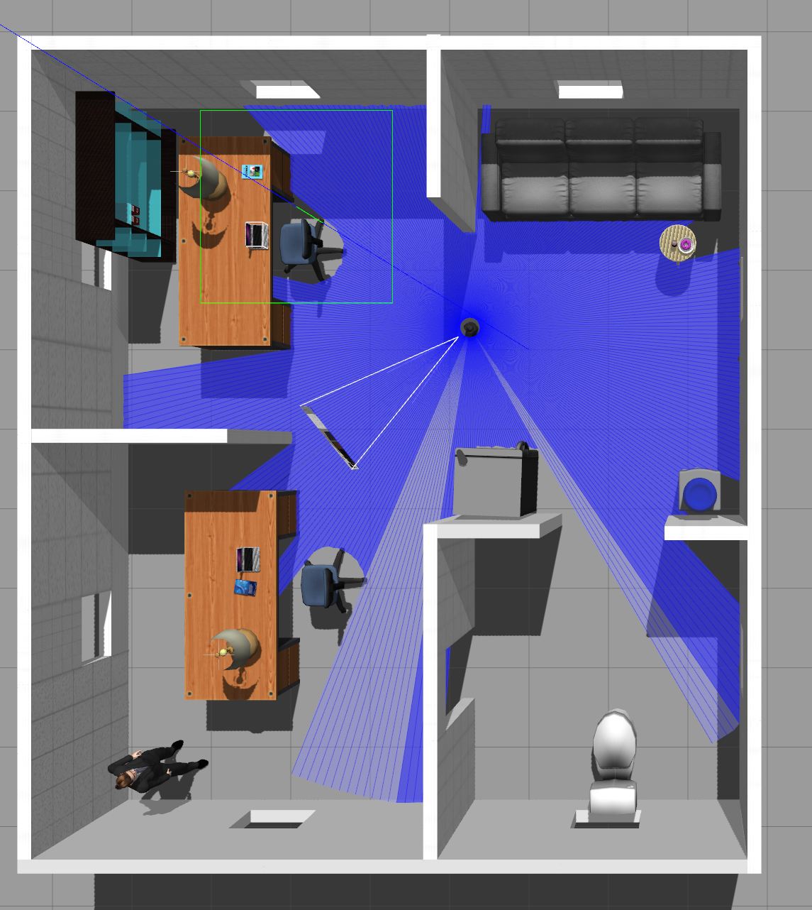
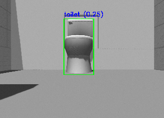

# Setup Instructions for VLM-based Semantic Navigation ROS2

## 1. Create the workspace and clone the repository

```bash
mkdir -p ~/tb3_ws/src/ && cd ~/tb3_ws/src/
git clone https://github.com/loggcc/VLM-based_semantic_navigation_ROS2.git
```


## 2. Install Gazebo, Navigation2, TurtleBot3 Simulation, and SLAM Toolbox


```bash
sudo apt update

sudo apt install ros-humble-navigation2
sudo apt install ros-humble-nav2-bringup
sudo apt install ros-humble-turtlebot3-gazebo
sudo apt install ros-humble-slam-toolbox
sudo apt install gazebo libgazebo-dev
```


## 3. Build gazebo office world with required models:

### Copy Office Model to Local Gazebo Models Directory

```bash

mkdir -p ~/.gazebo/models/
cp -r /tb3_ws/VLM-based_semantic_navigation_ROS2/turtlebot3_simulations/turtlebot3_gazebo/models/turtlebot3_office/* ~/.gazebo/models/


```

## 4. Install CLIP and dependencies for VLM-based perception and navigation

```bash

cd ~/tb3_ws/src/VLM-based_semantic_navigation_ROS2
pip install -r requirements.txt

```


## 5. Build the package

```bash
cd ~/tb3_ws
colcon build --symlink-install
source /opt/ros/humble/setup.bash
source install/setup.bash

```

# Running
## Task 1: Autonomous Exploration and Mapping

This task demonstrates exploration and mapping using TurtleBot3 in Gazebo with Nav2 and SLAM Toolbox with explore_lite.

### Launch gazebo Simulation, run Navigation and SLAM stack

Both TurtleBot3 models, Waffle and Burger, are equipped with Intel RealSense RGB-D cameras, and the Gazebo simulation environment is configured as an office scene. The maximum LiDAR scan range is set to 6.0 m to enhance exploration coverage.


```bash
cd ~/tb3_ws
export TURTLEBOT3_MODEL=burger
source ~/tb3_ws/install/setup.bash

ros2 launch turtlebot3_gazebo turtlebot3_office.launch.py \
    x_pose:=0.0 y_pose:=0.0 use_sim_time:=true use_rviz:=false headless:=true &

ros2 launch nav2_bringup navigation_launch.py use_sim_time:=True headless:=False &

ros2 launch slam_toolbox online_async_launch.py use_sim_time:=True &

ros2 run rviz2 rviz2 -d /opt/ros/humble/share/nav2_bringup/rviz/nav2_default_view.rviz

```


### Run exploration 


```bash
source install/setup.bash
ros2 launch explore_lite explore.launch.py
```

### Save Map:

```bash
ros2 run nav2_map_server map_saver_cli -f $NAV2_MAP_PATH
```
### Simulation
You can add the explore/frontiers topic to visualize the exploration frontiers in RViz2. This allows you to see which frontier is selected for exploration.


## Task 2: RRT* based Navigation


RRT* (Rapidly-exploring Random Tree Star) is used in navigation and path planning because it provides asymptotic optimality, meaning that as the number of samples increases, the solution converges to the optimal path while efficiently exploring high-dimensional spaces. Compared to standard RRT, RRT* rewires the tree to reduce path cost, producing smoother and shorter paths.


### Launch office world, Nav2 stack, Localization and RViz
```bash

cd ~/tb3_ws
export TURTLEBOT3_MODEL=burger
export NAV2_MAP_PATH=/home/ariel/tb3_ws/src/VLM-based_semantic_navigation_ROS2/turtlebot3_simulations/turtlebot3_gazebo/map/office_map.yaml


source ~/tb3_ws/install/setup.bash

# Launch Gazebo world
ros2 launch turtlebot3_gazebo turtlebot3_office.launch.py \
    x_pose:=0.0 y_pose:=0.0 use_sim_time:=true use_rviz:=false headless:=true &

# Nav2 stack
ros2 launch nav2_bringup navigation_launch.py \
    use_sim_time:=True \
    params_file:=/home/ariel/tb3_ws/src/VLM-based_semantic_navigation_ROS2/TurtleBot-RRT-Star/nav2_params.yaml \
    map:=$NAV2_MAP_PATH &

# Localization
ros2 launch nav2_bringup localization_launch.py \
    use_sim_time:=true \
    map:=$NAV2_MAP_PATH &

# RViz
ros2 run rviz2 rviz2 -d /opt/ros/humble/share/nav2_bringup/rviz/nav2_default_view.rviz

```

Once the simulation is running, verify the robot’s location in Gazebo. In RViz, click the 2D Pose Estimate button and set the initial pose on the map to match the robot’s position and orientation. Then, use the Nav2 Goal button to select a target location on the map, adjusting the orientation arrow as needed. The robot will begin navigating to the goal, and the planned path will be displayed in RViz.


## Task 3-1: Agentic Semantic Reasoning-VLM semantic labeling

The Agentic Semantic Reasoning framework consists of two main components: (1) Semantic Object Labeling, which identifies key objects using a vision-language model; (2) Semantic Navigation, where the robot uses the saved object memory to navigate via semantic landmarks.


The semantic labeling module combines Faster R-CNN and CLIP for zero-shot object detection. Given an object list (e.g., ["Refrigerator", "water dispenser", "sofa", "white toilet", "office chair with wheels"]), Faster R-CNN first proposes candidate regions from RGB frames. Each region is embedded and compared with textual labels using CLIP via cosine similarity to assign the most likely label. The object’s center coordinates, combined with RGB-D data, are recorded during exploration, and confidence scores with positions are stored in a JSON file, updating only when a higher-confidence detection occurs.


### Launch gazebo world and slam & Nav2 stack for exploration
```bash

export TURTLEBOT3_MODEL=burger
source ~/tb3_ws/install/setup.bash

ros2 launch turtlebot3_gazebo turtlebot3_office.launch.py \
    x_pose:=0.0 y_pose:=0.0 use_sim_time:=true use_rviz:=false headless:=true &

ros2 launch nav2_bringup navigation_launch.py use_sim_time:=True headless:=False &

ros2 launch slam_toolbox online_async_launch.py use_sim_time:=True &

ros2 run rviz2 rviz2 -d /opt/ros/humble/share/nav2_bringup/rviz/nav2_default_view.rviz

```
### Run the VLM labeling node:

```bash
source ~/tb3_ws/install/setup.bash
ros2 run vlm_perception_pkg vlm_detection
```





## Task 3-2: Agentic Semantic Reasoning-Semantic reasoning and Navigation

After building the "semantic memory", as saved in the JSON file, this section enables goal-directed navigation based on the user's query.The system loads previously detected objects with their positions and encodes their labels using CLIP to create a shared embedding space. When a user provides a query, the node matches it to the closest known object in the memory and retrieves its position. 


```bash

source ~/tb3_ws/install/setup.bash
# Gazebo
ros2 launch turtlebot3_gazebo turtlebot3_office.launch.py \
    x_pose:=0.0 y_pose:=0.0 use_sim_time:=true use_rviz:=false headless:=true &

# Nav2 stack
ros2 launch nav2_bringup navigation_launch.py \
    use_sim_time:=True \
    map:=$NAV2_MAP_PATH &

# Localization
ros2 launch nav2_bringup localization_launch.py \
    use_sim_time:=true \
    map:=$NAV2_MAP_PATH &

# RViz
ros2 run rviz2 rviz2 -d /opt/ros/humble/share/nav2_bringup/rviz/nav2_default_view.rviz
```

### Run the Semantic Navigation node


```bash
source ~/tb3_ws/install/setup.bash
ros2 run vlm_nav_pkg semantic_nav
```


## References 
- Exploration ROS2: [m-explore-ros2](https://github.com/robo-friends/m-explore-ros2.git)  
- RRT* Algorithm: [TurtleBot-RRT-Star](https://github.com/mmcza/TurtleBot-RRT-Star.git)  
- CLIP: [OpenAI CLIP](https://github.com/openai/CLIP.git)  
- CLIP-based VLM Detection: [clip-object-detection](https://github.com/deepmancer/clip-object-detection.git)  

